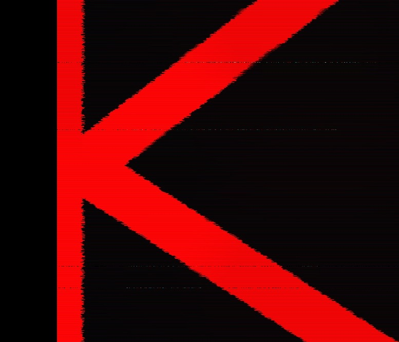

# 🏯 Keep • [](https://github.com/kalidao/keep/actions/workflows/tests.yml)   

## Model

`Keep` is a flexible governance system represented as an [ERC1155](https://ethereum.org/en/developers/docs/standards/tokens/erc-1155/) collection of NFTs. All stakeholders are tokenized, and group decisionmaking includes multi-sig and DAO voting features. Keep NFTs are semi-fungible. This means in some cases, they represent 1:1 rights, such as multi-sig and minting roles. Otherwise, they might be DAO voting balances or assets, such as [Moloch-style](https://github.com/MolochVentures/moloch) loot shares.

### Empowering Collectives

In addition to the core multi-sig feature, where decisions can be executed quickly after a signature threshold of quorum is met, balances associated with Keep token IDs all have [Compound-style](https://github.com/compound-finance/compound-protocol/tree/master/contracts/Governance) delegation and checkpointing. This means they can be easily integrated into on-chain voting and treasury systems regardless of their transferability, such as [`Kali`](https://github.com/kalidao/keep/blob/main/src/extensions/dao/Kali.sol).

The use of the ERC1155 standard further allows DAOs to all be located within a given public key address, across different networks, but grow at their own pace with specialized subgroups with their own related tokens and NFT branding. The shared address simplifies accounting, development of related applications, and demonstrates a cohesive brand and identity, as DAOs can be found on NFT galleries under the same URL.

Keep is therefore designed with the special lifecycle, memes and iteration of internet organizations in mind.

#### Kinds of Keeps

##### Keep Company

Startup founders might deploy a Keep Co. to hold runway in digital currency and represent their cap table with tokens. The founders and/or board members of the startup legal entity (which may be attached to the Keep as a [Wrappr NFT](https://www.wrappr.wtf/)) would likely be the multi-sig managers of the Keep treasury. Associated agreements, such as SAFE/T, token warrants, and equity shares can be issued at the deployment stage of the Keep Co., or as periodically decided by managers voting through the Keep app, as their own NFTs. These NFTs and related balances can be distributed while still being nontransferable. Likewise, whitelisting can be managed so tokens can only be transferred between certain accounts or exchanges, allowing liquidity and security-token features.

##### Keep Cooperative

Close membership associations, such as guilds and professional groups, can represent each member, 1:1, as a Keep multi-sig token holder. Larger cooperatives might engage a board of managers as the Keep multi-sig feature, while representing membership in related Keep tokens. Group decisions can be polled through snapshot-style proposals, and activated once a quorum is met in a single transaction, without the need for on-chain voting. This provides a premium cooperative experience as there is true membership control over their dues and related expenditures, minimal blockchain interaction (*i.e.*, good UX), while having the natural finance of smart contracts. Capital might be contributed through the [tribute extension](https://github.com/kalidao/tribute-router) as a form of association dues, or in more business-like groups, capital contribution to an investment club or company.

##### Keep Collective

Software might be distributed and give governance over its development and establish decision hiearchy through Keep tokens. A multi-sig can rotate among popular delegates of Keep tokens, keeping management efficient while distributed. Material decisions, such as minting tokens, moving assets or upgrading protocol contracts might be given over to large, slow on-chain voting. These might be settled through a single, or multiple protocol DAO tokens associated with the Keep.

### Gas Efficiency

Keep is designed to be minimalist, easy to build with, and rests on well-documented, gas-optimized snippets from [Solady](https://github.com/Vectorized/solady), [Solmate](https://github.com/transmissions11/solmate), [Zolidity](https://github.com/z0r0z/zolidity) and [OpenZeppelin](https://github.com/OpenZeppelin/openzeppelin-contracts).

#### Gas comparison with Gnosis Safe (2 signers):

| Transaction   | Safe          | Keep  |
| ------------- |:-------------:| -----:|
| Deploy        | 263k          | 178k |
| Dai transfer  | 88k           | 57k |

Sources:

* [Gnosis Safe deployment](https://help.gnosis-safe.io/en/articles/4290276-costs-of-creating-a-safe).
* [Gnosis Safe transactions](https://help.gnosis-safe.io/en/articles/4933491-gas-estimation).

### Tests

All contracts and [tests](https://github.com/kalidao/keep/tree/main/test) are written in [Solidity](https://github.com/ethereum/solidity) and can be run using [forge](https://github.com/foundry-rs/forge-std) commands.

### Audits

Several rounds of audits and security consultations were engaged in the development of Keep. Careful consideration was put into keeping the code as lean as possible and commenting around optimization choices. [Solidity Finance](https://solidity.finance/) completed two [audit reports](https://github.com/kalidao/keep/tree/main/audit) on the Keep core contracts, [Alcibiades Capital](https://alcibiades.capital/) contributed to additional design and implemented the contract testing suite, with an additional published [review](https://alcibiades.capital/blog/kali-multi-sig/), [Kyaa](https://kyaa.xyz/) assisted with gas optimizations, and a [bug bounty/optimization contest](https://twitter.com/z0r0zzz/status/1586396812855738369?s=20&t=xBKblOvBBd2lpnEaBndNZg) was completed with the wider security community. The [Kali DAO development](https://www.kali.gg/) team, which led the implementation of Keep in collaboration with [12 community contributors](https://github.com/kalidao/keep/blob/main/src/Keep.sol#L9), keeps its digital assets in Keep.

## Blueprint

```ml
lib
├─ forge-std — https://github.com/brockelmore/forge-std
├─ kali — https://github.com/kalidao/rage-router
├─ solbase — https://github.com/Sol-DAO/solbase
src
│  └─ extensions
│  └─ metadata
│  └─ ...
│  └─ URIFetcher - "Open-ended metadata fetcher for ERC1155"
├─ KeepToken — "Modern, minimalist, and gas-optimized ERC1155 implementation with Compound-style voting and flexible permissioning scheme"
├─ Keep — "Tokenized multisig wallet"
└─ KeepFactory — "Keep Factory"
├─ tests
│  └─ ...
```

## Deployments

Keep is deployed to the `Ethereum`, `Arbitrum`, `Optimism`, `Polygon` and `Gnosis` blockchains at the following verified addresses:

`KeepFactory`: `0x00000000001cd071bd24a7561e642b3e121c9761`

`Keep`: `0x00000000058b15c4250af3e8a10a6cf2a0e0f1c4`

`URIfetcher`: `0xcCfC4897C01e3E0885AEe45643868276894c40eb`

## Development

[Keep](https://github.com/kalidao/keep) is built with [Foundry](https://github.com/gakonst/foundry).

**Setup**
```bash
forge install
```

**Building**
```bash
forge build
```

**Testing**
```bash
forge test
```

**Configure Foundry**

Using [foundry.toml](./foundry.toml), Foundry is easily configurable.

For a full list of configuration options, see the Foundry [configuration documentation](https://github.com/gakonst/foundry/blob/master/config/README.md#all-options).

## Learn more 

You can find the [docs](https://keep-kalico.vercel.app/) for Keep contracts here.

## License

[MIT](https://github.com/kalidao/keep/blob/main/LICENSE)
